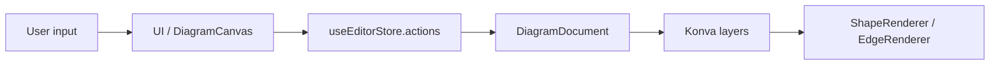
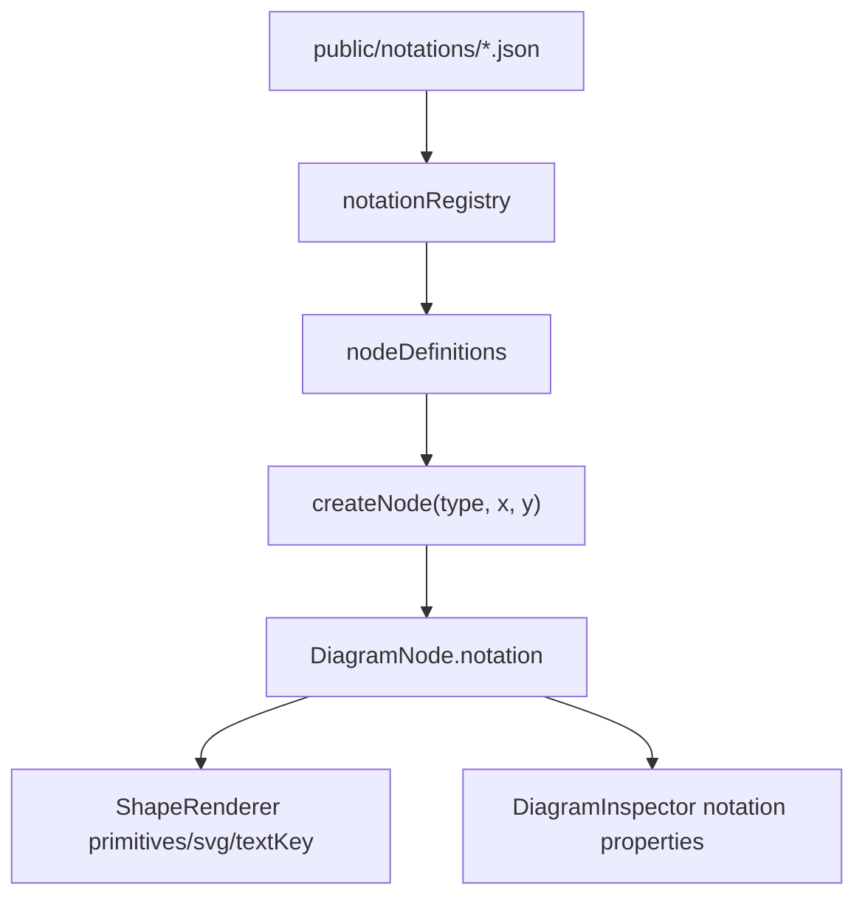
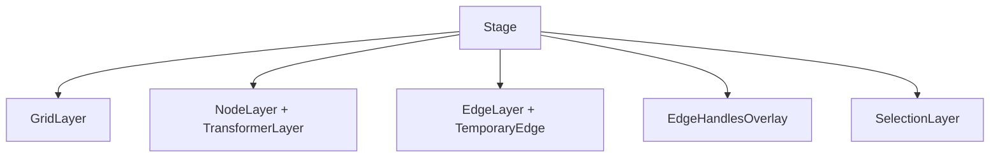

Правило импорта слоев

> Модуль (файл) в слайсе может импортировать другие слайсы только если они находятся на слоях строго ниже.

## Структура проекта (Слои)

1. App (`@app`)
   Всё, что касается приложения целиком: маршруты, глобальный store, глобальные стили и entrypoint.
2. Pages (`@pages`)
   Страницы приложения: presenter, request, component, modal, route, schema, style.
3. Widgets (`@widgets`)
   Самодостаточные блоки интерфейса, собранные из features/entities.
4. Features (`@features`)
   Прикладные сценарии: формы, фильтры, действия, авторизация.
5. Entities (`@entities`)
   Бизнес-сущности, их модели, API и базовая визуализация.
6. Shared (`@shared`)
   Переиспользуемая инфраструктура: API, UI-kit, lib, config, routes, i18n.

Рекомендации:

- Все пути импортов через `@/`, а не относительные (`../../`).
- Каждый слой должен быть самодостаточным и не тянуть зависимости, которые ему не принадлежат.
- Изолированные сложные подсистемы допускаются в `src/modules/*`; они должны быть переносимыми и не смешивать доменную модель с внешними страницами.

## Архитектура графического редактора диаграмм

Модуль `src/modules/diagram` — изолированный canvas-редактор диаграмм. Он построен вокруг трех идей:

1. **Документ как источник правды**: узлы и связи хранятся в `DiagramDocument`.
2. **Konva-render pipeline**: React собирает UI, а сцена рисуется слоями Konva.
3. **Декларативные нотации**: BPMN/UML/C4 и базовые фигуры описывают геометрию, свойства и поведение через реестры.

Дополнительный контекст по подсистемам вынесен в `docs/diagram-editor/`.

### 1. Структура модуля

```text
src/modules/diagram
├── canvas
│   ├── DiagramCanvas.tsx
│   ├── RendererRegistry.ts
│   ├── customRenderers
│   ├── layers
│   └── renderers
├── model
│   ├── factories
│   ├── registry
│   ├── serializers
│   ├── types
│   └── util
├── store
│   ├── editor.store.ts
│   ├── selectors.ts
│   ├── history
│   └── slices
└── ui
    ├── DiagramEditor.tsx
    ├── DiagramSidebar.tsx
    ├── DiagramToolbar.tsx
    └── DiagramInspector.tsx
```

Назначение директорий:

- `ui` — каркас редактора: toolbar, sidebar, inspector, layout.
- `canvas` — сцена Konva, слои, рендереры узлов/ребер/оверлеев.
- `model` — типы документа, фабрики, реестры нотаций, сериализация, геометрия.
- `store` — Zustand-store, selectors, undo/redo, состояние selection/viewport/interaction.

### 2. Модель данных

Документ описан в `model/types/document.types.ts`:

```ts
type DiagramDocument = {
  nodes: DiagramNode[]
  edges: DiagramEdge[]
}
```

#### Узел

`DiagramNode` хранит:

- `id`, `type`
- мировые координаты `x`, `y`
- размеры `width`, `height`
- `rotation`
- пользовательский `label`
- `style` и `textStyle`
- `notation?: NodeNotation`
- `customRendererId?: string`
- политики рендера/resize: `renderLabel`, `canStretch`, `preserveAspectRatio`
- служебный индекс связей `edges: { id; direction }[]`
- `createdAt`, `updatedAt`

Координаты узла хранятся в мировом пространстве холста. Viewport не меняет `node.x/node.y`; он трансформирует слои.

#### Ребро

`DiagramEdge` хранит:

- `id`
- `source` и `target` как `EdgeAnchor`
- `type`: `straight`, `orthogonal`, `bezier`
- `controlPoints`
- `style`: цвет, толщина, dash, `startCap`, `endCap`
- `label` и `labelStyle`

`EdgeAnchor` может быть привязан к узлу (`nodeId`, `anchorId`) или хранить свободную точку `point`. Это позволяет ребру существовать как между узлами, так и как свободная линия.

#### Viewport

`ViewportState` хранит:

- `x`
- `y`
- `zoom`

Viewport применяется к Konva-слоям через `layer.position()` и `layer.scale()`. Поэтому геометрия узлов и ребер остается в мировых координатах.

### 3. Состояние и команды

Центральный store: `store/editor.store.ts`.

Store содержит:

- `document`: текущие `nodes` и `edges`
- `history`: `past/future` снапшоты документа для undo/redo
- `selection.ids`: выбранные id узлов или ребер
- `viewport`
- `interaction`: флаги drag/connect/hover/selectionBox
- `actions`: команды изменения документа и UI-состояния

Основные команды:

- `addNode`, `updateNode`, `deleteNode`
- `addEdge`, `updateEdge`, `deleteEdge`
- `deleteSelection`
- `selectNode`
- `setViewport`
- `loadDocument`, `clearDocument`
- `undo`, `redo`
- interaction-флаги: `setNodeDragActive`, `setEdgeHandleDragActive`, `setHoveredEdgeId`, `setAnchorHighlightNodeId`

Изменения документа кладут текущий документ в history через `pushPastSnapshot`, сбрасывают `future`, затем меняют состояние. При изменении узла пересчитываются связанные ребра через `recalculateEdge`.

### 4. Нотации и декларативные фигуры

Исходные JSON-нотации находятся в `public/notations/`:

- `bpmn.json`
- `uml.json`
- `c4.json`

Runtime-реестр: `model/registry/notationRegistry.ts`.

Он:

- импортирует JSON-нотации
- читает `elements`
- нормализует `properties`
- превращает элементы в `NotationDefinition[]`
- формирует `notation.id` вида `${notationId}.${element.type}`
- задает `box`: начальные размеры и resize-политики
- создает fallback-примитив из `defaults.shapeType`, если `primitives` не заданы

`nodeDefinitions.ts` объединяет:

- базовые фигуры (`rectangle`, `circle`, `diamond`)
- элементы BPMN/UML/C4 из `notations`

При создании узла `createNode(type, x, y)` берет `NodeDefinition`, клонирует нотацию через `cloneNotation`, проставляет размеры, стили и политики рендера.

Поддерживаемые `NodePrimitive`:

- `rect`
- `circle`
- `diamond`
- `text`
- `svg`

Размеры примитива могут быть относительными (`0..1`) или абсолютными. `ShapeRenderer` масштабирует относительные значения к `node.width/node.height`.

`text`-примитив может иметь `textKey`; тогда отображаемый текст берется из `node.notation.properties`.

### 4.1 Декларативная система JSON‑нотаций

Нотации описываются в JSON‑файлах, расположенных в `public/notations/`. Структура файла:

```json
{
  "id": "bpmn",
  "name": "BPMN 2.0",
  "version": "1.0",
  "elements": [
    {
      "type": "bpmn-task",
      "name": "Задача",
      "extends": "shape",
      "icon": "mdiSquare",
      "defaults": {
        "shapeType": "rectangle",
        "width": 140,
        "height": 70,
        "style": {
          "fill": "#DBEAFE",
          "stroke": "#3B82F6",
          "strokeWidth": 2,
          "opacity": 1
        }
      },
      "properties": [
        { "name": "label", "label": "Название", "type": "text", "default": "Новая задача" },
        { "name": "taskType", "label": "Тип задачи", "type": "select", "options": ["user","service"], "default": "user" }
      ]
    }
    // …другие элементы
  ],
  "connections": {
    "allowedTypes": ["bpmn-task","bpmn-gateway","bpmn-event"],
    "edgeDefaults": {
      "stroke": "#475569",
      "strokeWidth": 2,
      "endArrow": "default"
    }
  },
  "validationRules": [
    { "rule": "startEventRequired", "message": "Диаграмма должна содержать начальное событие" }
  ]
}
```

Ключевые поля:

* **id / name / version** – идентификатор набора нотаций.
* **elements** – массив описаний фигур. Каждый элемент содержит:
  * `type` – уникальный тип, используемый в `DiagramNode.type`.
  * `extends` – базовый тип (`shape`, `zone` и т.п.) определяет, какие свойства наследуются.
  * `icon` – имя иконки из Material Design Icons.
  * `defaults` – набор начальных параметров: `shapeType` (primitive), `width`, `height`, `style` (fill, stroke, …).
  * `properties` – список пользовательских свойств, отображаемых в инспекторе. Каждый параметр описывается типом (`text`, `number`, `color`, `select`, `boolean`), значением по умолчанию и, при необходимости, набором вариантов.
* **connections** – правила создания ребер между элементами и набор дефолтных стилей ребра.
* **validationRules** – набор правил валидации, которые проверяются при сохранении диаграммы.

Во время инициализации `notationRegistry.ts` происходит:

1. Динамический импорт всех JSON‑файлов из `public/notations/`.
2. Для каждого `element` формируется `NotationDefinition`:
   * `id` формируется как `${notationId}.${element.type}`.
   * `primitives` создаются из `defaults.shapeType` и размеров; если `primitives` не заданы, используется fallback‑primitive.
   * `properties` нормализуются, добавляя тип и значение по умолчанию.
   * `box`‑поле задаёт стартовые размеры и политику `canStretch / preserveAspectRatio`.
3. Полученные определения объединяются с базовыми примитивами (`rectangle`, `circle`, `diamond`) в `nodeDefinitions.ts`, что делает их доступными в `DiagramSidebar`.

Эти нотации позволяют добавлять новые типы фигур без изменения кода редактора – достаточно добавить/отредактировать JSON‑файл и перезапустить приложение.

### 5. Canvas и слои

Корневой canvas: `canvas/DiagramCanvas.tsx`.

Он отвечает за:

- создание `Stage`
- хранение refs на слои
- применение viewport
- pan/zoom
- drag/drop из sidebar
- selection box
- старт/завершение соединения узлов
- клавиатурные действия Delete, Ctrl/Cmd+Z, Ctrl/Cmd+Y
- batched draw через `requestAnimationFrame`

Слои:

- `GridLayer` — фоновая сетка
- `NodeLayer` — узлы
- `TransformerLayer` — resize выбранных узлов
- `EdgeLayer` — ребра
- `TemporaryEdge` — временная линия при создании связи
- `EdgeHandlesOverlay` — ручки выбранного ребра
- `SelectionLayer` — прямоугольник выделения

Важно: viewport применяется к `grid`, `node`, `edge`, `handles` слоям. Overlay selection box живет в экранных координатах и не масштабируется как граф.

### 6. Рендер узлов

Главный рендерер: `canvas/renderers/ShapeRenderer.tsx`.

Алгоритм:

1. Создать Konva `Group` с id узла.
2. Зарегистрировать group в `nodeRegistry`.
3. Если задан `customRendererId` и найден кастомный рендерер — использовать его.
4. Иначе, если `node.notation.svg` задан — отрисовать SVG как image.
5. Иначе отрисовать `node.notation.primitives`.
6. Если `renderLabel !== false` — отрисовать `node.label`.
7. При hover/подсветке показать `AnchorOverlay`.

При drag узла `ShapeRenderer` вызывает `syncEdgeKonva` для связанных ребер, чтобы линия двигалась без полного React-цикла. На `dragEnd` состояние документа фиксируется через `updateNode`.

### 7. Рендер ребер и геометрия

Главный рендерер: `canvas/renderers/EdgeRenderer.tsx`.

Он:

- рассчитывает точки через `resolveEdgePoints(edge, nodes)`
- рисует `Line`
- отдельно рисует `Arrow` для `startCap/endCap`
- регистрирует refs в `edgeRegistry`
- отображает label в средней точке маршрута
- по double click добавляет control point и переводит ребро в `orthogonal`

Геометрия вынесена в `model/util/edgeGeometry.ts`:

- `closestPointOnRectPerimeter`
- `getAnchorPoint`
- `resolveEdgePoints`
- `flattenEdgePoints`

Live-синхронизация DOM/Konva без полного rerender находится в `model/util/syncEdgeKonva.ts`. Она обновляет points линии и points маркеров стрелок.

### 8. Якоря, соединения и snapping

Якоря узла строятся через `model/factories/getNodeAnchors.ts`. Визуально они появляются в `AnchorOverlay` при hover узла или при наведении концом ребра.

Создание связи:

1. Пользователь тянет от anchor узла.
2. `DiagramCanvas.startConnection()` создает `tempConnection`.
3. `TemporaryEdge` рисует временную линию.
4. При отпускании на другом узле `finishConnection()` создает `DiagramEdge`.
5. `addEdge()` добавляет ребро в документ и обновляет `node.edges` у source/target.

Редактирование связи:

- `EdgeHandlesOverlay` показывает endpoint handles и control points для выбранного ребра.
- Control point можно перетаскивать.
- Endpoint можно перетаскивать; на `dragEnd` `snapEdgeEndpointToGraph()` пытается привязать его к узлам/якорям.

### 9. UI редактора

`DiagramEditor.tsx` собирает редактор:

- верхняя панель `DiagramToolbar`
- левая библиотека фигур `DiagramSidebar`
- центральный `DiagramCanvas`
- правый `DiagramInspector`

`DiagramSidebar`:

- строит список из `nodeDefinitions`
- группирует элементы по `base`, `bpmn`, `uml`, `c4`
- показывает миниатюру нотации по primitives
- поддерживает drag/drop на canvas
- по click создает узел в центре текущего viewport

`DiagramToolbar`:

- undo/redo
- быстрое добавление прямоугольника в центр viewport

`DiagramInspector`:

- для узла редактирует label, fill, stroke, strokeWidth, cornerRadius, textStyle, свойства нотации
- для ребра редактирует label, labelStyle, type, stroke, strokeWidth, start/end cap, control points

### 10. Сериализация

`model/serializers/document.serializer.ts`:

- `serialize(document)` возвращает JSON
- `deserialize(raw)` принимает массивы или object-map формат
- нормализует узлы и ребра
- восстанавливает `node.edges` на основе `edge.source/target`
- добавляет дефолтные `style`, `textStyle`, `type`, `controlPoints`, `label`

Это позволяет сохранять документ без дублирования производных индексов, а после загрузки восстановить служебные связи.

### 11. Производительность

Основные приемы:

- разделение сцены на Konva-слои
- `batchDraw()` вместо немедленной полной перерисовки
- общий `requestDraw()` через `requestAnimationFrame`
- `nodeRegistry` и `edgeRegistry` для точечного обновления Konva-объектов
- live-обновление ребер при drag без записи каждого intermediate mouse move в Zustand
- запись финального состояния узла/ребра только на `dragEnd`

### 12. Текущие ограничения

- `bezier` присутствует в типе ребра и инспекторе, но отдельная bezier-геометрия пока не реализована.
- JSON-нотации уже содержат элементы с `extends: "edge"`, но текущий `notationRegistry` маппит все `elements` в `NodeDefinition`; полноценный декларативный реестр типов связей еще нужен.
- `EdgeEndStyle` сейчас поддерживает `none` и `arrow`; кастомные маркеры вроде crow's foot требуют расширения модели.
- Страницы/вкладки внутри одного документа пока не реализованы: `DiagramDocument` содержит один набор `nodes/edges`.
- `Minimap.tsx` и часть старых slice-файлов пока пустые.

### 13. End-to-end поток

Добавление узла:

1. Sidebar click или drop на canvas.
2. `createNode(type, x, y)`.
3. `nodeDefinitions` находит описание типа.
4. `cloneNotation()` копирует primitives/properties.
5. `actions.addNode()` кладет узел в документ.
6. `NodeLayer` отрисовывает `ShapeRenderer`.

Создание ребра:

1. `AnchorOverlay` вызывает `onStartConnection`.
2. `DiagramCanvas` ведет `tempConnection`.
3. `TemporaryEdge` рисует временную линию.
4. `onFinishConnection` создает `DiagramEdge`.
5. `actions.addEdge()` добавляет ребро и обновляет индексы узлов.
6. `EdgeLayer` отрисовывает `EdgeRenderer`.

Перемещение узла:

1. Konva group двигается в `ShapeRenderer`.
2. На `dragMove` связанные ребра обновляются через `syncEdgeKonva`.
3. На `dragEnd` `updateNode()` фиксирует новые координаты в Zustand.
4. History получает снапшот для undo.

### 14. Схемы архитектуры

Поток данных:



Связь нотаций с runtime:



Слои canvas:



## TODO по графическому редактору

См. `docs/TODO.md`. На момент обновления документации:

- базовый drag/drop работает
- создание фигуры в центре viewport работает через sidebar/toolbar
- primitives/svg/составные фигуры частично поддержаны
- custom renderer registry есть
- BPMN/UML/C4 загружаются как наборы узлов
- кастомные декларативные типы ребер и страницы документа еще требуют отдельной реализации
