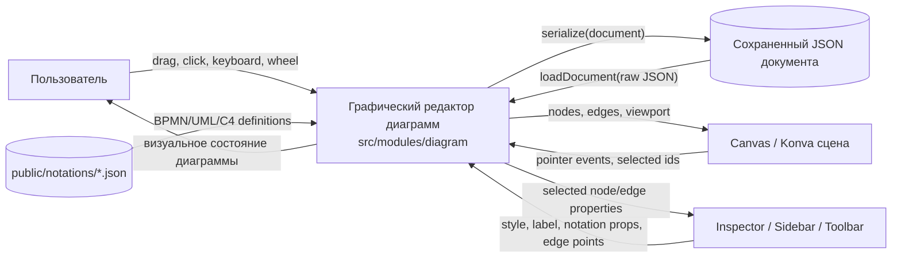
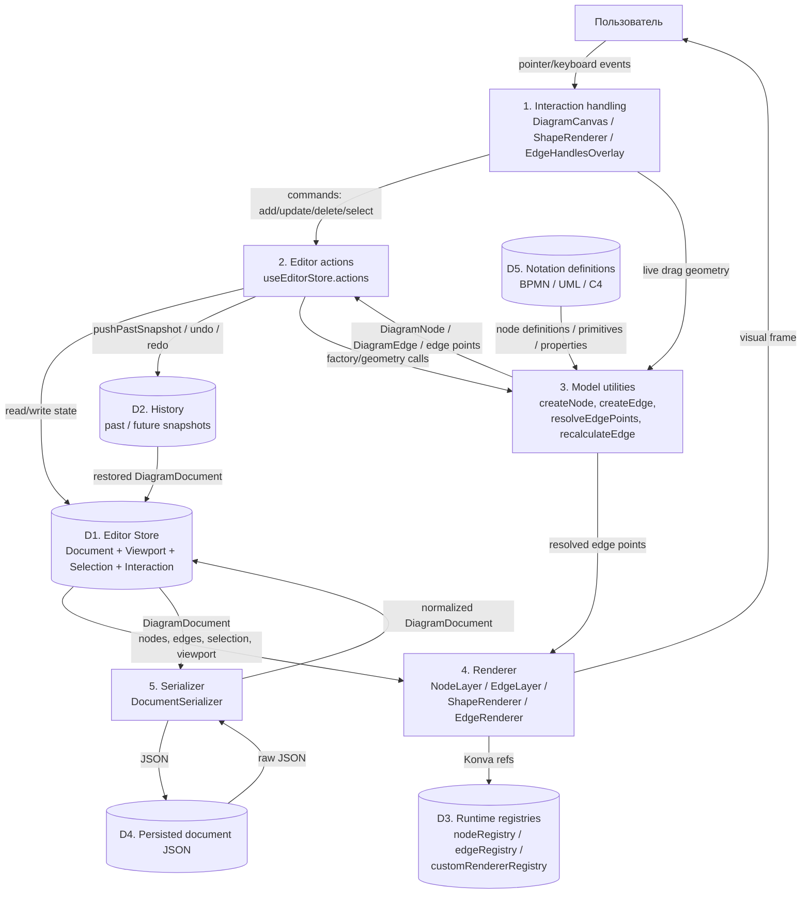
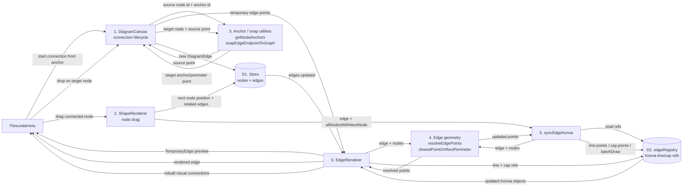
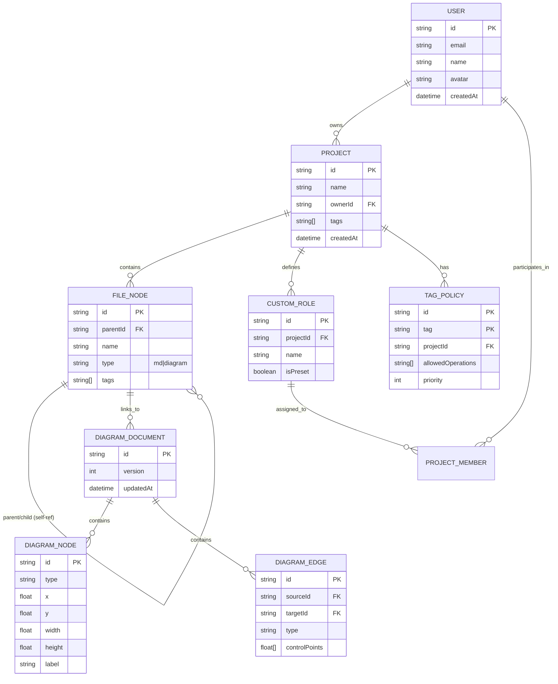
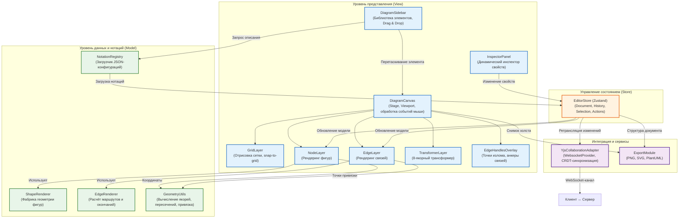

# DFD Diagrams

Показательные DFD для модуля `src/modules/diagram`.

## DFD Level 0: Контекст графического редактора

Диаграмма показывает редактор как единый процесс и основные внешние/внутренние потоки данных.

## DFD Level 1: Редактирование документа диаграммы

Диаграмма раскрывает ключевые процессы внутри редактора: ввод пользователя, commands/store, model utilities и renderer.

## DFD Level 1: Создание и перестроение связей

Диаграмма фокусируется на данных, которые проходят через создание связи и последующее обновление геометрии при перемещении узла.

