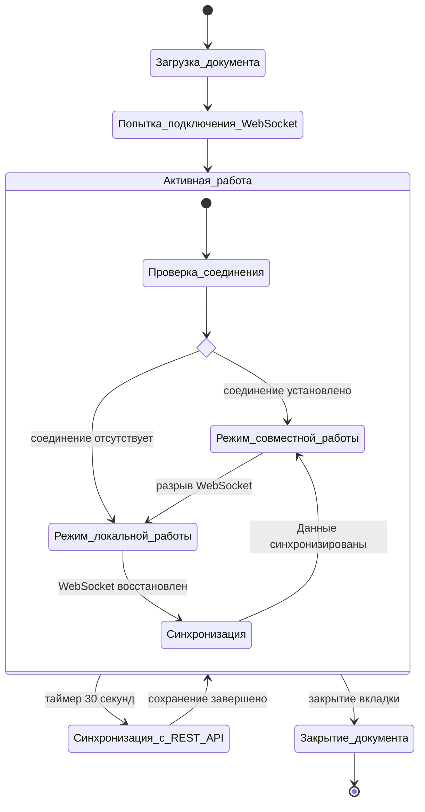
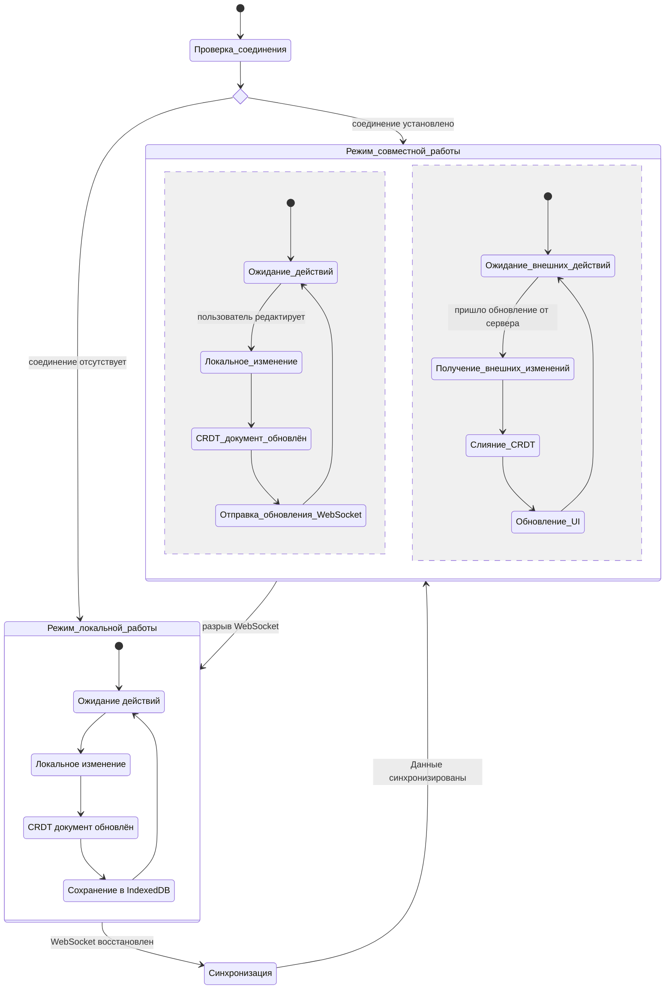

```mermaid
stateDiagram-v2
    [*] --> Загрузка_документа
    Загрузка_документа --> Попытка_подключения_WebSocket
    Попытка_подключения_WebSocket --> Активная_работа
    
    state Активная_работа {
        [*] --> Проверка_соединения
        state if_state <<choice>>
        Проверка_соединения --> if_state
        if_state --> Режим_совместной_работы: соединение установлено
        if_state --> Режим_локальной_работы: соединение отсутствует
        
        state Режим_совместной_работы
        
        state Режим_локальной_работы
        
        Режим_совместной_работы --> Режим_локальной_работы: разрыв WebSocket
	    Режим_локальной_работы --> Синхронизация: WebSocket восстановлен
	    Синхронизация --> Режим_совместной_работы: Данные синхронизированы
    }
    
    Активная_работа --> Синхронизация_с_REST_API : таймер 30 секунд
    Синхронизация_с_REST_API --> Активная_работа : сохранение завершено
    
    
    Активная_работа --> Закрытие_документа: закрытие вкладки
    Закрытие_документа --> [*]
    
```

```mermaid
stateDiagram-v2
    [*] --> Проверка_соединения
    state if_state <<choice>>
    Проверка_соединения --> if_state
    if_state --> Режим_совместной_работы: соединение установлено
    if_state --> Режим_локальной_работы: соединение отсутствует    
    state Режим_совместной_работы
    state Режим_локальной_работы
        
    Режим_совместной_работы --> Режим_локальной_работы: разрыв WebSocket
    Режим_локальной_работы --> Синхронизация: WebSocket восстановлен
    Синхронизация --> Режим_совместной_работы: Данные синхронизированы
    
    
    state Режим_совместной_работы {
        [*] --> Ожидание_действий
        Ожидание_действий --> Локальное_изменение: пользователь редактирует
        Локальное_изменение --> CRDT_документ_обновлён
        CRDT_документ_обновлён --> Отправка_обновления_WebSocket
        Отправка_обновления_WebSocket --> Ожидание_действий
        --
        [*] --> Ожидание_внешних_действий
        Ожидание_внешних_действий --> Получение_внешних_изменений: пришло обновление от сервера
        Получение_внешних_изменений --> Слияние_CRDT
        Слияние_CRDT --> Обновление_UI
        Обновление_UI --> Ожидание_внешних_действий
    }
    
    state Режим_локальной_работы {
	    state "Ожидание действий" as Ожидание_действий_локально
	    state "Локальное изменение" as Локальное_изменение_офлайн
	    state "CRDT документ обновлён" as CRDT_документ_обновлён_локально
	    state "Сохранение в IndexedDB" as Сохранение_в_IndexedDB
        [*] --> Ожидание_действий_локально
        Ожидание_действий_локально --> Локальное_изменение_офлайн
        Локальное_изменение_офлайн --> CRDT_документ_обновлён_локально
        CRDT_документ_обновлён_локально --> Сохранение_в_IndexedDB
        Сохранение_в_IndexedDB --> Ожидание_действий_локально
    }
    
```

```mermaid
stateDiagram-v2

	state "Редактирование (CRDT)" as Editing
	state "Синхронизация (CRDT)" as Syncing
	state "Разрешение конфликтов (CRDT)" as ConflictResolution

    [*] --> Disconnected: Инициализация приложения

    Disconnected --> Connecting: Пользователь открывает документ

    Connecting --> Authenticating: WebSocket handshake

    Authenticating --> LoadingDoc: Auth успешна

    Authenticating --> AuthFailed: Ошибка аутентификации

    AuthFailed --> Disconnected: Таймаут / Повтор

    LoadingDoc --> Syncing: Загрузка Y.Doc завершена

    LoadingDoc --> LoadFailed: Ошибка загрузки

    LoadFailed --> Disconnected: Возврат на главную

    Syncing --> Connected: Полная синхронизация

    Connected --> Editing: Пользователь начинает редактирование

    Editing --> Connected: Изменение сохранено

    Connected --> AwarenessUpdate: Обновление курсора/выделения

    AwarenessUpdate --> Connected: Трансляция другим клиентам

    Connected --> Offline: Потеря соединения

    Editing --> Offline: Потеря соединения при редактировании

    Offline --> QueuingChanges: Пользователь редактирует офлайн

    QueuingChanges --> Offline: Продолжение офлайн-работы

    QueuingChanges --> Reconnecting: Соединение восстановлено

    Reconnecting --> SyncPending: Переподключение успешно

    SyncPending --> ConflictResolution: Есть конфликты

    ConflictResolution --> SyncPending: Авто-разрешение (CRDT)

    SyncPending --> Connected: Синхронизация очереди изменений

    Reconnecting --> Offline: Не удалось переподключиться

    Offline --> Disconnected: Превышено время ожидания

    Connected --> SavingSnapshot: Автосохранение (30 сек)

    SavingSnapshot --> Connected: REST API 200 OK

    SavingSnapshot --> VersionConflict: REST API 409 Conflict

    VersionConflict --> FetchLatest: Загрузка актуальной версии

    FetchLatest --> MergeChanges: Слияние локальных изменений

    MergeChanges --> SavingSnapshot: Повторное сохранение

    Connected --> ClosingDoc: Пользователь закрывает документ

    ClosingDoc --> FinalSave: Финальное сохранение

    FinalSave --> Disconnected: Выход из комнаты

    Connected --> Logout: Пользователь выходит

    Logout --> Cleanup: Очистка состояния

    Cleanup --> Disconnected: Возврат на страницу входа
    
	state "CRDT Document" as CRDT {
        Editing
        Syncing
        ConflictResolution
    }
	state "Network Layer" as Network {
        Connecting
        Connected
        Offline
        Reconnecting
    }
	state "Persistence" as Persist {
        SavingSnapshot
        FinalSave
        VersionConflict

    }

    classDef activeState fill:#90EE90,stroke:#228B22,stroke-width:2px

    classDef errorState fill:#FFB6C1,stroke:#DC143C,stroke-width:2px

    classDef warningState fill:#FFE4B5,stroke:#FF8C00,stroke-width:2px

    classDef normalState fill:#E6E6FA,stroke:#9370DB,stroke-width:1px

    class Connected,Editing,Syncing activeState

    class AuthFailed,LoadFailed,VersionConflict errorState

    class Offline,Reconnecting,QueuingChanges warningState

    class Disconnected,Connecting,Authenticating,LoadingDoc,SavingSnapshot,FinalSave,ClosingDoc,Logout,Cleanup,ConflictResolution,SyncPending,FetchLatest,MergeChanges,AwarenessUpdate normalState
```
