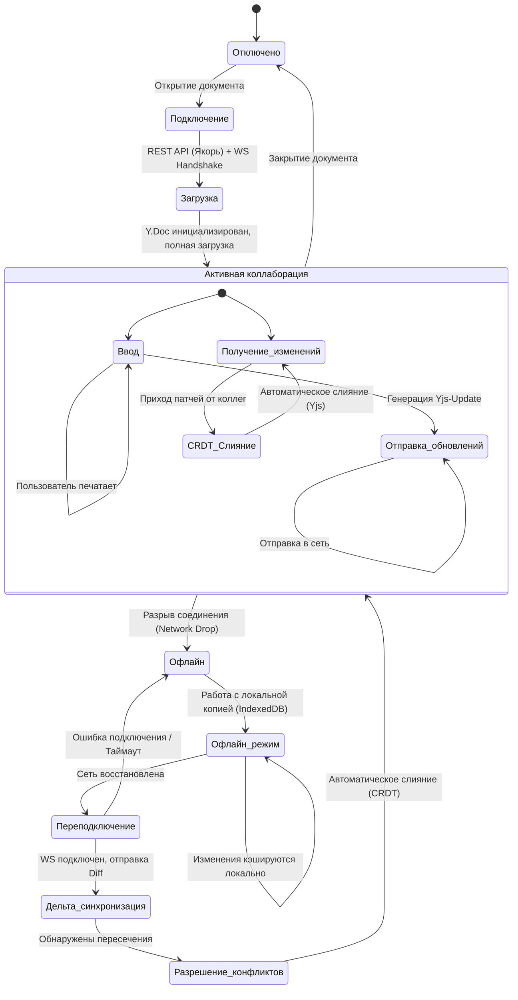

```mermaid
stateDiagram-v2
    direction TB
    
    [*] --> Отключено
    
    Отключено --> Подключение : Открытие документа
    Подключение --> Загрузка : REST API (Якорь) + WS Handshake
    Загрузка --> Работа_в_сети : Y.Doc инициализирован, полная загрузка
    
    state "Активная коллаборация" as Работа_в_сети {
        direction TB
        [*] --> Ввод
        Ввод --> Ввод : Пользователь печатает
        Ввод --> Отправка_обновлений : Генерация Yjs-Update
        Отправка_обновлений --> Отправка_обновлений : Отправка в сеть
        
        [*] --> Получение_изменений
        Получение_изменений --> CRDT_Слияние : Приход патчей от коллег
        CRDT_Слияние --> Получение_изменений : Автоматическое слияние (Yjs)
    }
    
    Работа_в_сети --> Офлайн : Разрыв соединения (Network Drop)
    
    Офлайн --> Офлайн_режим : Работа с локальной копией (IndexedDB)
    Офлайн_режим --> Офлайн_режим : Изменения кэшируются локально
    
    Офлайн_режим --> Переподключение : Сеть восстановлена
    Переподключение --> Дельта_синхронизация : WS подключен, отправка Diff
    Дельта_синхронизация --> Разрешение_конфликтов : Обнаружены пересечения
    Разрешение_конфликтов --> Работа_в_сети : Автоматическое слияние (CRDT)
    
    Переподключение --> Офлайн : Ошибка подключения / Таймаут
    Работа_в_сети --> Отключено : Закрытие документа
```

```mermaid
stateDiagram-v2

	state "Редактирование (CRDT)" as Editing
	state "Синхронизация (CRDT)" as Syncing
	state "Разрешение конфликтов (CRDT)" as ConflictResolution

    [*] --> Disconnected: Инициализация приложения

    Disconnected --> Connecting: Пользователь открывает документ

    Connecting --> Authenticating: WebSocket handshake

    Authenticating --> LoadingDoc: Auth успешна

    Authenticating --> AuthFailed: Ошибка аутентификации

    AuthFailed --> Disconnected: Таймаут / Повтор

    LoadingDoc --> Syncing: Загрузка Y.Doc завершена

    LoadingDoc --> LoadFailed: Ошибка загрузки

    LoadFailed --> Disconnected: Возврат на главную

    Syncing --> Connected: Полная синхронизация

    Connected --> Editing: Пользователь начинает редактирование

    Editing --> Connected: Изменение сохранено

    Connected --> AwarenessUpdate: Обновление курсора/выделения

    AwarenessUpdate --> Connected: Трансляция другим клиентам

    Connected --> Offline: Потеря соединения

    Editing --> Offline: Потеря соединения при редактировании

    Offline --> QueuingChanges: Пользователь редактирует офлайн

    QueuingChanges --> Offline: Продолжение офлайн-работы

    QueuingChanges --> Reconnecting: Соединение восстановлено

    Reconnecting --> SyncPending: Переподключение успешно

    SyncPending --> ConflictResolution: Есть конфликты

    ConflictResolution --> SyncPending: Авто-разрешение (CRDT)

    SyncPending --> Connected: Синхронизация очереди изменений

    Reconnecting --> Offline: Не удалось переподключиться

    Offline --> Disconnected: Превышено время ожидания

    Connected --> SavingSnapshot: Автосохранение (30 сек)

    SavingSnapshot --> Connected: REST API 200 OK

    SavingSnapshot --> VersionConflict: REST API 409 Conflict

    VersionConflict --> FetchLatest: Загрузка актуальной версии

    FetchLatest --> MergeChanges: Слияние локальных изменений

    MergeChanges --> SavingSnapshot: Повторное сохранение

    Connected --> ClosingDoc: Пользователь закрывает документ

    ClosingDoc --> FinalSave: Финальное сохранение

    FinalSave --> Disconnected: Выход из комнаты

    Connected --> Logout: Пользователь выходит

    Logout --> Cleanup: Очистка состояния

    Cleanup --> Disconnected: Возврат на страницу входа
    
	state "CRDT Document" as CRDT {
        Editing
        Syncing
        ConflictResolution
    }
	state "Network Layer" as Network {
        Connecting
        Connected
        Offline
        Reconnecting
    }
	state "Persistence" as Persist {
        SavingSnapshot
        FinalSave
        VersionConflict

    }

    classDef activeState fill:#90EE90,stroke:#228B22,stroke-width:2px

    classDef errorState fill:#FFB6C1,stroke:#DC143C,stroke-width:2px

    classDef warningState fill:#FFE4B5,stroke:#FF8C00,stroke-width:2px

    classDef normalState fill:#E6E6FA,stroke:#9370DB,stroke-width:1px

    class Connected,Editing,Syncing activeState

    class AuthFailed,LoadFailed,VersionConflict errorState

    class Offline,Reconnecting,QueuingChanges warningState

    class Disconnected,Connecting,Authenticating,LoadingDoc,SavingSnapshot,FinalSave,ClosingDoc,Logout,Cleanup,ConflictResolution,SyncPending,FetchLatest,MergeChanges,AwarenessUpdate normalState
```
