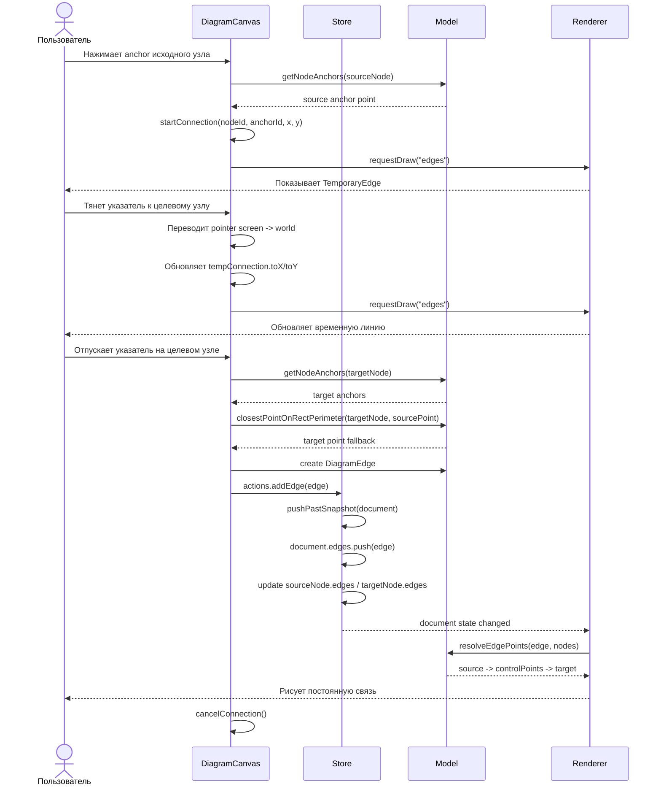
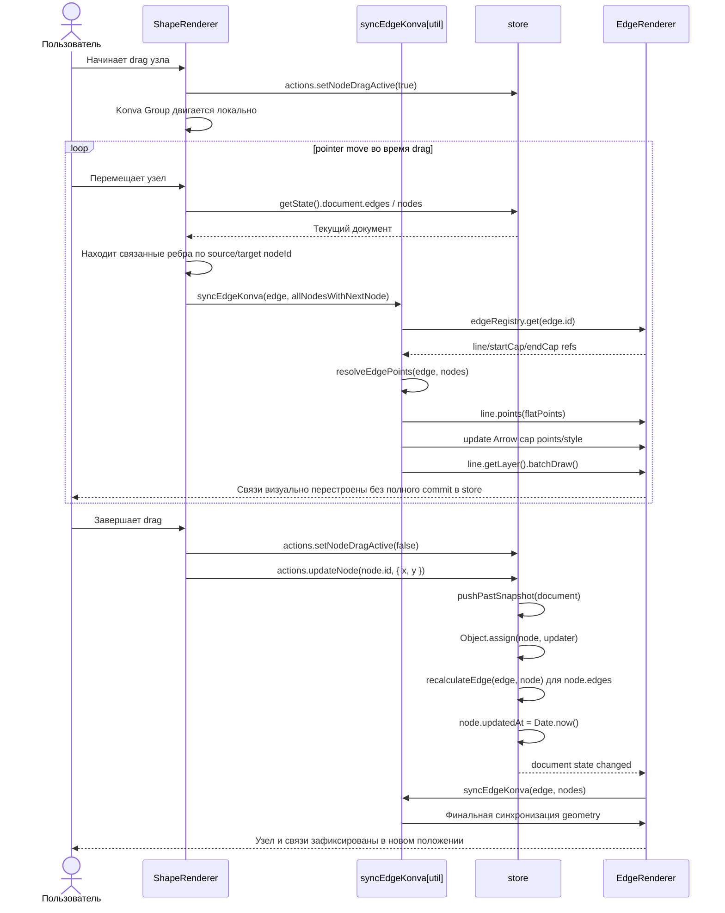

# Sequence Diagrams

UML sequence-диаграммы для ключевых сценариев модуля `src/modules/diagram`.

## Создание связи между двумя узлами

Участники:

- Пользователь
- `DiagramCanvas`
- `Store`
- `Model`
- `Renderer`

## Перемещение узла с автоматическим перестроением связей

Участники:

- Пользователь
- `ShapeRenderer`
- `syncEdgeKonva[util]`
- `store`
- `EdgeRenderer`

