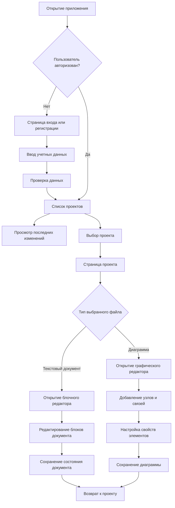

User Flow представляет собой описание последовательности действий пользователя при достижении целевых результатов в приложении. Для проектируемой системы такой результат связан с созданием или открытием проекта, переходом к нужному документу, редактированием текстового или графического артефакта и сохранением изменений. Диаграмма пользовательского потока применяется на этапе проектирования для согласования структуры интерфейса с реальными сценариями работы аналитика, архитектора и участника проектной команды.

В основе пользовательского потока лежит переход от общего контекста к конкретному артефакту. После входа в приложение пользователь получает доступ к списку проектов и последним изменениям. Далее выбирается проект, внутри которого отображается файловая структура, документы, диаграммы и элементы навигации. При открытии текстового документа пользователь переходит к блочному редактору, а при выборе диаграммы - к графическому редактору нотаций.

Представленный поток позволяет выделить несколько важных требований к клиентской части. Во-первых, навигация должна сохранять контекст проекта при переходе к отдельным документам. Во-вторых, редакторы необходимо загружать только при обращении к соответствующим страницам, поскольку текстовый и графический редакторы имеют собственные зависимости и повышают размер клиентского бандла. В-третьих, пользовательские действия внутри редакторов должны приводить к изменению состояния документа без полной перезагрузки страницы.

Отдельное значение имеет сценарий возврата к списку проектов или к странице проекта. Пользователь должен иметь возможность быстро сменить документ, открыть другой тип артефакта и продолжить работу с тем же проектным контекстом. Поэтому пользовательский поток связан с последовательностью экранов, требованиями к маршрутизации, состоянию приложения и структурой навигационных компонентов.
