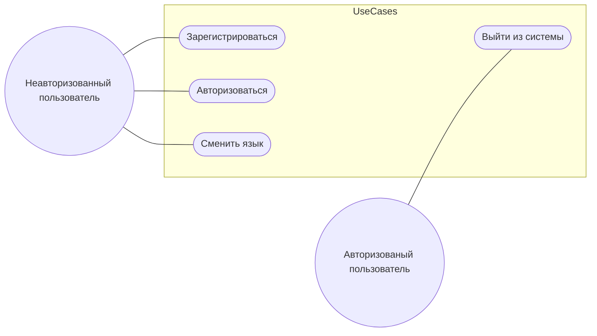
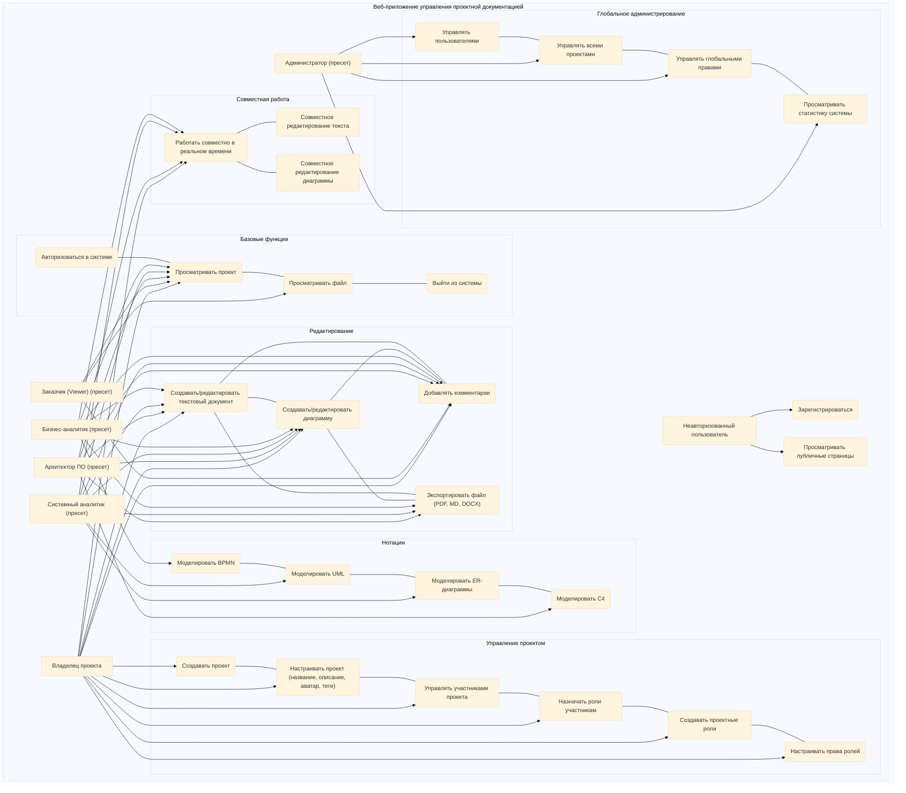

При использовании приложения выделяются две роли: авторизованный пользователь и неавторизованный пользователь.

Рисунок  – Диаграмма вариантов использования

//баллада о формировании требований, сценарии использования и пользовательские истории

Роли:

|Актёр|Описание|
|---|---|
|**Неавторизованный пользователь**|Пользователь, не вошедший в систему. Может зарегистрироваться и просматривать публичные страницы.|
|**Бизнес-аналитик (пресет)**|Готовая роль с предустановленными правами (BPMN, Use Case, документация).|
|**Системный аналитик (пресет)**|Готовая роль (UML, ER, DFD, техническая документация).|
|**Архитектор ПО (пресет)**|Готовая роль (C4, архитектурные решения).|
|**Заказчик (пресет)**|Готовая роль (только просмотр и комментирование).|
|**Администратор (пресет)**|Готовая роль (полный доступ ко всем проектам и глобальным настройкам).|
|**Владелец проекта**|Пользователь, создавший проект. Управляет настройками проекта, участниками и их ролями.|

User Stories:

|ID|Роль|Я хочу …|Чтобы …|
|---|---|---|---|
|US-01|Бизнес-аналитик|создавать схемы BPMN и Use Case|визуализировать бизнес-процессы и сценарии использования|
|US-02|Системный аналитик|строить UML Sequence и Activity диаграммы|моделировать взаимодействия и алгоритмы системы|
|US-03|Архитектор ПО|использовать нотацию C4|описывать архитектуру системы с уровнями декомпозиции|
|US-04|Любой аналитик|добавлять комментарии к элементам схемы|обсуждать детали с командой|
|US-05|Любой аналитик|создавать текстовую документацию рядом со схемой|вести описательную часть проекта|
|US-06|Пользователь|экспортировать документацию в docx и md|использовать файлы во внешних отчётах и системах|
|US-07|Заказчик|просматривать схемы и оставлять комментарии|контролировать ход проектирования|
|US-08|Пользователь|работать совместно в одной схеме|обеспечить коллективное редактирование|

Сводная таблица «Актёр – Варианты использования»

|Актёр|Варианты использования|
|---|---|
|**Неавторизованный пользователь**|Регистрация, просмотр публичных страниц|
|**Бизнес-аналитик (пресет)**|Просмотр проекта, создание/редактирование документов и диаграмм, моделирование BPMN, комментирование, экспорт, совместная работа|
|**Системный аналитик (пресет)**|То же + UML, ER|
|**Архитектор ПО (пресет)**|То же + C4|
|**Заказчик (пресет)**|Просмотр проекта и файлов, комментирование|
|**Администратор (пресет)**|Управление пользователями, проектами, глобальными правами, просмотр статистики|
|**Владелец проекта**|Создание и настройка проекта, управление участниками и ролями внутри проекта, все функции участника|