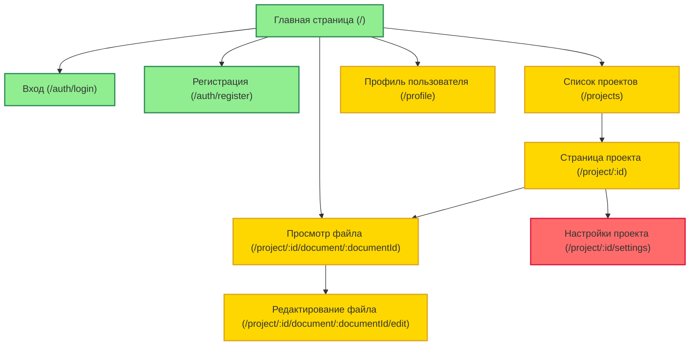

// Схема и пояснения

Карта сайта (рисунок 2.2) представляет собой иерархическую структуру всех страниц веб-приложения. Каждый узел соответствует отдельной странице или разделу. Цвет узла определяет доступность страницы для разных категорий пользователей.

| Цвет узла  | Доступность                                                                  |
| ---------- | ---------------------------------------------------------------------------- |
| 🟩 Зелёный | Доступен всем пользователям (включая неавторизованных)                       |
| 🟨 Жёлтый  | Доступен только авторизованным пользователям                                 |
| 🟥 Красный | Доступен только пользователям с ролью «Администратор» или «Владелец проекта» |

Рисунок -- Карта сайта

| URL                              | Страница             | Описание                                                                        | Доступность                         |
| -------------------------------- | -------------------- | ------------------------------------------------------------------------------- | ----------------------------------- |
| `/`                              | Главная страница     | Приветственный экран, общая информация, ссылки на вход/регистрацию              | Все пользователи                    |
| `/auth/login`                    | Вход                 | Форма входа по email/паролю, ссылка на восстановление пароля, кнопки OAuth2     | Все пользователи                    |
| `/auth/register`                 | Регистрация          | Форма регистрации нового пользователя                                           | Все пользователи                    |
| `/projects`                      | Список проектов      | Список проектов текущего пользователя с фильтрацией и поиском                   | Авторизованные                      |
| `/project/:id`                   | Страница проекта     | Файловый менеджер проекта, отображение иерархии папок и файлов                  | Участники проекта                   |
| `/project/:id/settings`          | Настройки проекта    | Редактирование метаинформации, управление участниками, настройка ролей          | Владелец проекта                    |
| `/project/:id/file/:fileId`      | Просмотр файла       | Отображение содержимого файла (документ или диаграмма) в режиме «только чтение» | Участники проекта                   |
| `/project/:id/file/:fileId/edit` | Редактирование файла | Редактор документа или диаграммы (с тулбаром, сайдбарами)                       | Участники проекта с правом «запись» |
| `/profile`                       | Профиль пользователя | Просмотр и редактирование личной информации, смена пароля, настройки интерфейса | Авторизованные                      |