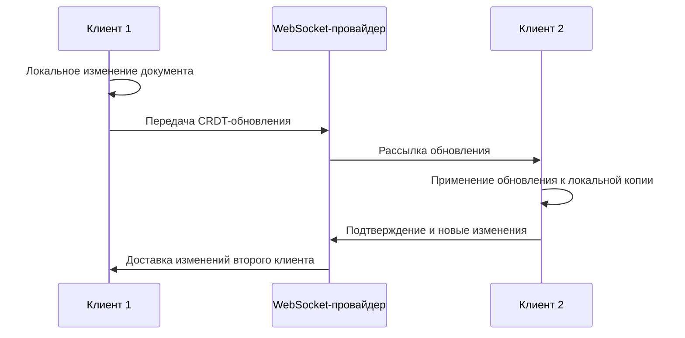

Совместная работа рассматривается как один из ключевых сценариев развития приложения, поскольку проектная документация обычно создается несколькими участниками. На уровне клиентской части необходимо предусмотреть такую модель, при которой текстовые документы и диаграммы могут редактироваться несколькими пользователями без потери изменений и без жесткой блокировки всего документа.

В качестве базового подхода выбрана синхронизация на основе CRDT. Данный подход позволяет каждому клиенту применять локальные изменения сразу после действия пользователя, а затем передавать операции другим участникам сессии. При получении удаленных операций состояние документа приводится к согласованному виду средствами CRDT-структуры.

Для текстового редактора применяется Yjs совместно с интеграцией `@lexical/yjs`. Такой вариант соответствует выбранному редактору Lexical и синхронизирует структуру документа на уровне блоков, текста и вложенных узлов. Для графического редактора совместная модель строится вокруг карты узлов, карты связей и параметров холста. Каждый элемент диаграммы получает устойчивый идентификатор, благодаря чему изменения координат, размеров, стилей и подписей передаются как независимые операции.

Модель совместного документа включает следующие логические части:
- содержимое документа: текстовые блоки или элементы диаграммы;
- сведения о присутствии пользователей: курсоры, выделенные элементы, имя и цвет участника;
- метаданные сессии: идентификатор проекта, идентификатор документа, версия и время последнего изменения;
- локальный журнал операций, необходимый для восстановления состояния после временного разрыва соединения.

На клиентской стороне синхронизация не блокирует интерфейс. Пользователь продолжает редактирование локально, а сетевой слой передает изменения асинхронно. После восстановления соединения накопленные операции отправляются на сервер и объединяются с изменениями других участников.

Интеграция совместной работы отделена от визуальных компонентов редакторов. Компоненты отвечают за отображение и обработку действий пользователя, тогда как CRDT-документ выполняет роль источника синхронизируемого состояния. Такое разделение сохраняет независимость интерфейса от сетевой логики и упрощает сопровождение редакторов.
