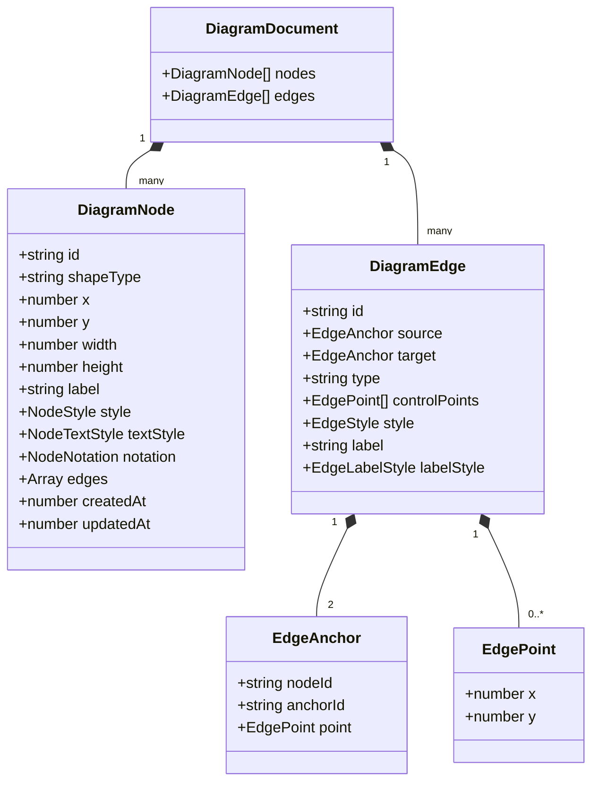

## 3.1 Холст

### 3.1.1 Панорамирование

Панорамирование реализовано через прослушивание событий `mousedown`/`touchstart` с кнопкой средней/правой мыши. При перемещении указателя изменяется `viewport` в Zustand‑сторе, которое применяется к `Stage` Konva через свойства `x` и `y`.

### 3.1.2 Масштабирование

Масштабирование обрабатывается событием `wheel`. При удержании клавиши `Ctrl` вычисляется новый коэффициент `zoom` (от 0.2 до 4.0) и центр масштабирования фиксируется в текущей позиции курсора, чтобы пользователь ощущал «зум в точку».

### 3.1.3 Сетка и привязка к сетке

`GridLayer` рисует вертикальные и горизонтальные линии с шагом, задаваемым в конфигурации (по умолчанию 24 px). При перемещении или создании узлов их координаты округляются до ближайшего узла сетки (snap‑to‑grid), что реализовано в утилите `snapToGrid` и вызывается перед сохранением позиции в сторе.

## 3.2 Реализация фигур

### 3.2.1 Базовые фигуры

Поддерживаются три базовых типа: прямоугольник, круг, ромб. Они реализованы как React‑компоненты, использующие `Konva.Shape` с параметрами `shapeType`, `width`, `height` и `fill`/`stroke` из `DiagramNode.style`.

### 3.2.2 Добавление, перемещение, удаление

- **Добавление** – пользователь перетаскивает элемент из боковой панели; `createNode(type, x, y)` клонирует конфигурацию нотации, задаёт начальные координаты и диспатчится `addNode` в стор.
- **Перемещение** – каждый `Konva.Group` узла имеет обработчик `dragmove`; при перемещении обновляются координаты и вызывается `recalculateEdge` для связанных связей.
- **Удаление** – при нажатии `Delete` вызывается `deleteSelection`, который удаляет все выбранные узлы и ребра из документа.

### 3.2.3 Трансформер

Для выбранного узла активируется `Transformer` Konva, предоставляющий 8 якорей. Свойства `keepRatio` и `enabledAnchors` задаются в зависимости от политики нотации (`canStretch`, `preserveAspectRatio`).

### 3.2.4 Редактирование стилей

Инспектор свойств позволяет менять `fill`, `stroke`, `strokeWidth` и текстовые свойства. При изменении действия диспатчатся `updateNodeStyle`/`updateNodeTextStyle`, которые мгновенно отражаются в Canvas.

## 3.3 Реализация связей

### 3.3.1 Создание связи перетаскиванием от якоря до якоря

Каждый узел содержит «точки соединения» (anchors). При нажатии и удержании на якоре инициируется временная линия (`TemporaryEdge`). При отпуске на целевом якоре формируется `DiagramEdge` с `source`/`target` и добавляется в стор через `addEdge`.

### 3.3.2 Автоматическое перестроение при перемещении узлов

`recalculateEdge` пересчитывает мостовые точки линии на основе текущих координат `source` и `target`, учитывая `snapToGrid` и наличие контрольных точек.

### 3.3.3 Точки излома

Пользователь может добавить контрольную точку двойным‑кликом по линии. Точки хранятся в массиве `controlPoints` у `DiagramEdge`. Перемещение точки обновляет `points` линии через `updateEdgeControlPoints`.

### 3.3.4 Стилизация связей

Стили (`stroke`, `strokeWidth`, `startArrow`, `endArrow`) задаются в `DiagramEdge.style` и применяются к `Konva.Line` и `Konva.Arrow` в `EdgeRenderer`.

## 3.4 Реализация инспектора свойств

### 3.4.1 Отображение свойств выбранного элемента

`PropertyInspector` читает `selectedId` из стора и динамически генерирует форму на основе `editableProperties` из JSON‑конфигурации нотации.

### 3.4.2 Редактирование текста, цвета, толщины

Изменения в форме вызывают действия `updateNode`, `updateEdgeStyle` и т.п., которые сразу мутируют состояние и сохраняются в `localStorage`.

### 3.4.3 Динамическое построение формы на основе JSON‑конфигурации

Каждый элемент нотации описывает массив `properties` (тип, метка, варианты). Инспектор перебирает их и рендерит соответствующие контролы (input, select, checkbox).

## 3.5 Реализация декларативной системы нотаций

### 3.5.1 Загрузка JSON‑файлов из `/public/notations/`

При старте приложения `loadNotations()` сканирует директорию, загружает файлы через `fetch`, парсит JSON и сохраняет их в `notationRegistry`.

### 3.5.2 Регистрация элементов в реестре

Для каждого `element` формируется уникальный `elementId = ${notation.id}.${element.type}` и сохраняется `NodeDefinition` (defaults, properties, geometry). Реестр используется боковой панелью `DiagramSidebar` и фабрикой `createNode`.

### 3.5.3 Примеры конфигураций: BPMN, UML, C4

Примеры находятся в `public/notations/bpmn.json`, `public/notations/uml.json`, `public/notations/c4.json`. Они описывают базовые фигуры, их свойства и правила соединений.

## 3.6 Управление состоянием

### 3.6.1 Хранение документа

Все данные диаграммы (`nodes`, `edges`) находятся в `EditorState.document`. Zustand‑стор обеспечивает мгновенный доступ и реактивные обновления UI.

### 3.6.2 История изменений

Каждое действие (добавление, удаление, перемещение, изменение стиля) создаёт копию текущего `DiagramDocument` и помещает её в `history.past`. Команды `undo`/`redo` переключаются между `past` и `future`.

### 3.6.3 Сериализация и десериализация диаграммы

При каждом изменении `saveDiagram()` сохраняет `document` в `localStorage` (JSON.stringify). При загрузке страницы `loadDiagram()` восстанавливает состояние из `localStorage` или создаёт пустой документ.

## 3.7 Модель данных (перенесено из раздела «Проектирование»)

```typescript
// Диаграмма хранит массивы узлов и связей
export type DiagramDocument = {
  nodes: DiagramNode[]
  edges: DiagramEdge[]
}

export type DiagramNode = {
  id: string
  type: string // дискриминатор, например 'shape'
  shapeType: 'rectangle' | 'circle' | 'diamond'
  x: number
  y: number
  width: number
  height: number
  label: string
  style: NodeStyle
  textStyle: NodeTextStyle
  notation?: NodeNotation // специфично для BPMN/UML/C4
  edges: { id: string; direction: 'in' | 'out' }[]
  createdAt: string
  updatedAt: string
}

export type NodeStyle = {
  fill: string
  stroke: string
  strokeWidth: number
  opacity?: number
}

export type NodeTextStyle = {
  fontFamily: string
  fontSize: number
  fontStyle?: string
  fill: string
}

export type DiagramEdge = {
  id: string
  source: EdgeAnchor
  target: EdgeAnchor
  type: 'straight' | 'orthogonal' | 'bezier'
  controlPoints: EdgePoint[]
  style: EdgeStyle
  label?: string
  labelStyle?: EdgeLabelStyle
}

export type EdgeAnchor = {
  nodeId?: string // если привязано к узлу
  point?: { x: number; y: number } // свободная точка
}

export type EdgePoint = { x: number; y: number }

export type EdgeStyle = {
  stroke: string
  strokeWidth: number
  startArrow?: string
  endArrow?: string
}

export type EdgeLabelStyle = {
  fontFamily: string
  fontSize: number
  fill: string
}

export interface EditorState {
  document: DiagramDocument
  history: { past: DiagramDocument[]; future: DiagramDocument[] }
  selection: { ids: string[] }
  viewport: { x: number; y: number; zoom: number }
  interaction: {
    dragging: boolean
    hoveredId?: string
    nodeDragActive: boolean
    edgeHandleDragActive: boolean
    hoveredEdgeId?: string | null
    anchorHighlightNodeId?: string | null
    selectionBox?: ISelectionBox
  }
  actions: { /* команды редактора */ }
}
```


